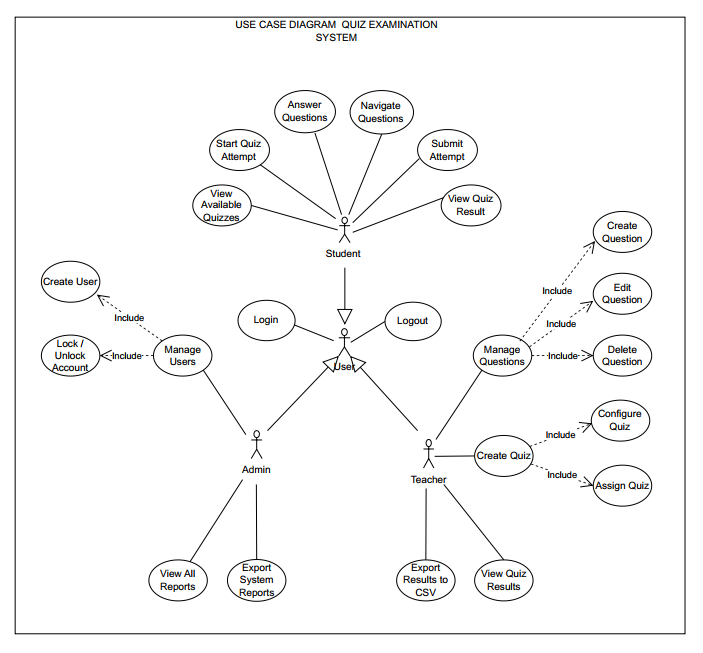

# QUIZ EXAMINATION SYSTEM
## Requirement specification & Design document

Project: Quiz examination system  
Course: Software Engineering  
Group: 05
Version: v1.2  
Date: 2026-01-05

## Revision history (Change log)
| Version | Date       | Changes |
|---------|------------|---------|
| v1.0    | 2025-12-25 | Add initial SRS document for Quiz Examination System |
| v1.1    | 2026-01-04 | Enhance SRS document with detailed functional requirements and system scope |
| v1.2    | 2026-01-05 | Add functional requirement for managing quiz lifecycle and data retention |
---

## System scope and purpose
- The purpose of the Quiz examination system is to provide a robust, scalable, and secure platform for conducting online multiple-choice tests. It aims to automate the entire lifecycle of an examination: from question bank management by teachers to automated grading and reporting for students and admins

## System actors
- Student: User who takes quizzes and views their own results
- Teacher: User who creates questions, manages quizzes, and views statistics
- Admin: User responsible for system management and user accounts

## Functional requirements

### FR-01 User authentication
- Description: The system shall allow users (Student/Teacher/Admin) to log in using a username and password
- Primary actors: Student, teacher, admin
- Preconditions: The user account exists in the database and is in an active state
- Main flow:
  1. The user enters username and password
  2. The system validates the credentials against the database
  3. The system creates a session and navigates the user to their respective home screen
- Alternative/exception flows:
  - Invalid credentials: The system shall show an error message: "Invalid username or password"
  - Account locking: If the user exceeds 5 failed attempts, the system shall temporarily lock the account for 30 minutes. After 30 minutes, the account shall be automatically unlocked
- Postconditions: The user is authenticated and granted access to role-based features
- Acceptance criteria:
  - System grants access only with correct credentials
  - Account locks exactly after the 5th failed attempt

### FR-02 Manage question bank
- Description: The system shall allow a teacher to manage (create, edit, delete) multiple choice questions in the question bank
- Primary actor: teacher
- Data fields: question text, answer options A B C D, correct option, difficulty level (easy medium hard), topic or tag
- Preconditions: teacher is logged in and has permission to manage questions
- Main flow (Create):
  1. Teacher selects "Add new questions"
  2. Teacher enters data for all required fields
  3. System validates the data including exactly one correct option selected
  4. System saves the question and displays a success message
- Exception flows:
  - Duplicate question: System warns if an identical question text already exists
  - Delete active question: If a question is currently in an active quiz, the system shall prevent deletion and show a warning
- Acceptance criteria:
  - Questions are successfully saved with all data fields
  - Non authorized users cannot access management functions

### FR-03 Create and configure quiz
- Description: The system shall allow a teacher to create a new quiz by selecting questions and configuring parameters
- Primary actor: teacher
- Preconditions: teacher has successfully logged in and has access to at least one question bank
- Main flow:
  1. Teacher selects "Create new quiz"
  2. Teacher enters quiz title and selects a set of questions from the question bank
  3. Teacher configures settings: time limit in minutes, total points, scoring rules, shuffle questions, shuffle answers options, and result visibility (immediate / after end time / manual release)
  4. System validates that the number of selected questions is greater than zero and settings are valid
  5. System saves the quiz and displays a "Quiz created successfully" message
- Exception flows:
  - Insufficient questions: If the teacher requests a random quiz with N questions but the bank has fewer than N, the system shall show an error message
  - Invalid configuration: If time limit or total points is set to a negative value, the system shall prevent saving and highlight the invalid fields
- Postconditions: A new quiz is stored in the database and is ready to be assigned to students
- Acceptance criteria:
  - The teacher can successfully save a quiz with all settings configured
  - The shuffle setting must be correctly applied when a student starts the quiz

#### Scoring rules
- The system shall support single choice questions with exactly one correct option
- For each question:
  - If the student selects the correct option, the system shall add the configured points for that question
  - If the student selects an incorrect option, the system shall add zero points
  - If the student leaves the question unanswered, the system shall add zero points
- The total score of an attempt shall be the sum of the points from all questions in that quiz

### FR-04 Take quiz attempt
- Description: The system shall allow a student to select an assigned quiz, perform the attempt within a time limit, and submit their responses for grading
- Primary actor: Student
- Preconditions:
  - Student is authenticated and authorized for the specific quiz
  - The current time is within the scheduled time window of the quiz (FR-07)
  - Student does not have any existing attempt for this quiz
- Attempt limit:
  - Each student shall be allowed to have at most one existing attempt for each quiz
- Main flow:
  1. Student selects a quiz from the list of available assessments
  2. System initializes the attempt, starts the countdown timer, and displays the first set of questions
  3. Student selects answers and navigates through questions (Previous/Next)
  4. The system shall automatically save the student's current answers when the student navigates between questions
  5. Student confirms and submits the attempt
  6. The system records the completion time and final responses into the database
- Alternative/Exception flows:
  - Time expiration:
    - If the countdown reaches zero, the system shall auto submit the last saved answers and notify the student
  - Attempt exists:
    - If an attempt for this quiz already exists, the system shall prevent starting a new attempt and show a clear message
- Postconditions:
  - The attempt is marked as submitted and the data is ready for the grading process
- Acceptance criteria:
  - A student cannot have more than one existing attempt for the same quiz
  - Answers are stored correctly even if the attempt is auto submitted due to time expiration

### FR-05 Auto grading and results
- Description: After a student submits a quiz, the system shall automatically calculate the score based on the pre defined correct options and store the results
- Primary actor: system
- Preconditions: The student has successfully submitted the quiz attempt (FR-04)
- Main flow:
  1. The system retrieves the student's answers and the correct answers for the quiz from the database
  2. The system compares answers and calculates the total score based on the scoring rules defined in FR-03
  3. The system generates an "Attempt summary" including total score, number of correct answers, number of incorrect answers, and completion time
  4. The system stores the score and summary in the student's history
  5. The system applies the visibility rule: results shall be shown immediately to the student unless configured otherwise by the teacher in FR-03
  6. If the quiz result visibility is set to "manual release", the system shall store the result but shall not display it to the student until the teacher releases results for that quiz
- Postconditions: The quiz result is permanently stored and linked to the student's account
- Acceptance criteria:
  - Grading must be accurate based on the answer key
  - During the project demo under 30 concurrent students, results must be stored in the database within 5 seconds after submission

### FR-06 View and export reports
- Description: The system shall allow teachers and admins to view a list of student attempts for a specific quiz and export these results to a CSV file
- Primary actors: Teacher, admin
- Preconditions: The user is logged in with appropriate permissions and at least one quiz attempt exists
- Main flow:
  1. User selects a specific quiz from the management dashboard
  2. System displays a table of all existing attempts (student username, completion date, score, time spent)
  3. User chooses the "Export to CSV" option
  4. System generates and downloads a CSV file containing all displayed data
- Alternative/Exception flows:
  - No attempts found:
    - If no attempts exist for the quiz, the system shall display a message: "No results available to display or export"
- Postconditions: A CSV file is downloaded to the user's device
- Acceptance criteria:
  - The displayed report must match the data in the database for that specific quiz
  - The exported CSV file must be readable by spreadsheet software (e.g., Excel) and contain all required fields

### FR-07 Schedule and assign quiz
- Description: The system shall allow a teacher to schedule a quiz by specifying a start time and an end time, and assign the quiz to specific students (or a class or group), so that only authorized students can access the quiz during the scheduled time window
- Primary actor: teacher
- Supporting actors: student
- Data fields:
  - Start time
  - End time
  - Assigned students
- Preconditions:
  - Teacher is authenticated (FR-01)
  - The quiz has been created (FR-03)
- Main flow:
  1. Teacher selects an existing quiz from the quiz management screen
  2. Teacher enters the start time and the end time of the quiz availability
  3. Teacher selects the target students
  4. The system validates that the start time is earlier than the end time and that at least one student is assigned
  5. The system saves the schedule time window
  6. The system makes the quiz visible and accessible only to assigned students during the scheduled time window
- Alternative/Exception flows:
  - Invalid time window: If the start time is not earlier than the end time, the system shall prevent saving and show an error message
  - No students assigned: If no student or class is selected, the system shall prevent saving and show an error message
- Postconditions:
  - The quiz schedule and assignment are stored
  - Students can start an attempt only if they are assigned and the current time is within the scheduled time window
- Acceptance criteria:
  - Unassigned students cannot see or start the quiz
  - Assigned students can start the quiz only during the scheduled time window
  - The system rejects invalid time windows and empty assignments

### FR-08 Manage user accounts
- Description: The system shall allow an admin to manage user accounts including creating accounts, disabling accounts, resetting passwords, and assigning roles for student and teacher
- Primary actor: Admin
- Preconditions:
  - Admin is authenticated (FR-01)
- Main flow:
  1. Admin opens the user management screen
  2. Admin creates a new user by entering username, initial password, and selecting a role
  3. Admin disables or enables an existing user account
  4. Admin resets a user password and provides a new initial password to the user
  5. The system saves the changes and logs the action with the admin identity and time
- Alternative/Exception flows:
  - Duplicate username: If the username already exists, the system shall reject the creation and show an error message
  - Invalid role assignment: If the admin selects an unsupported role, the system shall reject the change and show an error message
- Postconditions:
  - User account changes are stored and take effect immediately
- Acceptance criteria:
  - Admin can create a student account and the student can log in using the provided credentials
  - Admin can disable an account and the disabled user cannot log in
  - Admin can reset a password and the user can log in using the new password

### FR-09 Delete and purge quiz
- Description: The system shall allow teacher to delete a quiz only when it has no existing attempts and allow admin to purge a quiz permanently even if it has attempts
- Primary actors: Teacher, admin
- Preconditions:
  - User is authenticated (FR-01)
  - User has permission to manage quizzes
- Main flow (Teacher delete quiz with zero attempts):
  1. Teacher selects a quiz from the quiz management screen
  2. Teacher chooses "Delete"
  3. System validates that the quiz has zero existing attempts
  4. System shows a confirmation dialog: "Delete this quiz? This action cannot be undone"
  5. Teacher confirms
  6. System deletes the quiz and displays a success message: "Quiz deleted successfully"
- Main flow (Admin purge quiz permanently):
  1. Admin selects a quiz from the quiz management screen
  2. Admin chooses "Purge permanently"
  3. System shows a confirmation dialog: "Purge permanently? This will delete the quiz and all attempts results and cannot be undone"
  4. Admin confirms
  5. System permanently deletes the quiz and all related attempts results
  6. System displays a success message: "Quiz purged successfully"
- Alternative/Exception flows:
  - Teacher delete blocked due to attempts:
    - If the quiz has one or more submitted attempts, the system shall block teacher deletion and show a message: "Cannot delete because this quiz has student attempts"
  - Non admin purge blocked:
    - If a non admin user attempts to purge, the system shall block and show a message: "Only admin can purge data permanently"
- Postconditions:
  - Teacher delete removes only quizzes with zero attempts
  - Admin purge removes the quiz and all related attempts results
- Acceptance criteria:
  - Teacher can delete a quiz only when the quiz has zero existing attempts
  - Admin can purge a quiz even when the quiz has one or more submitted attempts
  - After admin purge, related attempts results are removed and the quiz no longer appears in reports

### FR-10 Delete student attempt
- Description: The system shall allow teacher and admin to permanently delete a student's quiz attempt from the database so the student can start a new attempt
- Primary actors: Teacher, admin
- Preconditions:
  - User is authenticated (FR-01)
  - The quiz exists and the attempt exists
  - The attempt belongs to the selected quiz
- Authorization rules:
  - Teacher can delete attempts only for quizzes created by that teacher
  - Admin can delete attempts for any quiz
- Main flow:
  1. Teacher admin selects a quiz from the management dashboard
  2. System displays the list of attempts for that quiz
  3. Teacher admin selects a specific student attempt
  4. Teacher admin chooses "Delete attempt"
  5. System shows a confirmation dialog: "Delete this attempt permanently? This action cannot be undone"
  6. Teacher admin confirms
  7. System permanently deletes the attempt from the database
  8. System permanently deletes all related attempt data including saved answers for that attempt
  9. System allows the student to start a new attempt for that quiz
- Alternative/Exception flows:
  - Unauthorized access:
    - If teacher tries to delete an attempt for a quiz not owned by that teacher the system shall block the operation and show a clear message
  - Attempt not found:
    - If the attempt no longer exists the system shall show an error message and refresh the attempt list
- Postconditions:
  - The deleted attempt is removed from the database and is no longer accessible
  - The student is allowed to create a new attempt for that quiz
- Acceptance criteria:
  - Teacher admin can delete an attempt and the student can start a new attempt
  - After deletion the attempt and its related answers do not appear in any report export or history query

### FR-11 User logout
- Description: The system shall allow an authenticated user (Student/Teacher/Admin) to log out and terminate the current authenticated session
- Primary actors: Student, teacher, admin
- Preconditions:
  - The user is authenticated (FR-01) and has an active session
- Main flow:
  1. The user selects "Logout"
  2. The system invalidates the user's current session/token on the server
  3. The system removes the authentication credential on the client (e.g., deletes auth cookie / clears stored token)
  4. The system navigates the user to the login screen
- Alternative/Exception flows:
  - Session already expired:
    - If the session is already expired, the system shall still navigate the user to the login screen and show a message: "Session expired. Please log in again"
- Postconditions:
  - The user is no longer authenticated and cannot access any role-based features without logging in again
- Acceptance criteria:
  - After logout, using the browser back button (or reopening the app window) shall not restore access to authenticated pages
  - Any request made with the old session/token after logout shall be rejected by the backend

### FR-12 Change password
- Description: The system shall allow an authenticated user (Student/Teacher/Admin) to change their password
- Primary actors: Student, teacher, admin
- Preconditions:
  - The user is authenticated (FR-01)
  - The user account is active
- Data fields:
  - Current password
  - New password
  - Confirm new password
- Main flow:
  1. The user opens "Account settings" and selects "Change password"
  2. The user enters current password, new password, and confirm new password
  3. The system validates:
     - Current password is correct
     - New password and confirm new password match
     - New password satisfies password policy (NFR-02)
  4. The system updates the stored password hash
  5. The system invalidates the user's current session and requires the user to log in again
  6. The system shows a success message: "Password changed successfully. Please log in again"
- Alternative/Exception flows:
  - Incorrect current password:
    - The system shall show an error message: "Current password is incorrect"
  - New password mismatch:
    - The system shall show an error message: "New password and confirmation do not match"
  - Policy violation:
    - If the new password violates NFR-02 constraints (e.g., too long), the system shall reject the change and highlight invalid fields
- Postconditions:
  - The new password takes effect immediately
  - The user must re-authenticate to access the system again
- Acceptance criteria:
  - The user cannot log in using the old password after a successful password change
  - The user can log in using the new password after a successful password change

### FR-13 Forgot password
- Description: The system shall not provide a self-service "Forgot password" feature for end users. Password reset shall be performed only by admin via user management functions (FR-08)
- Primary actor: Admin
- Supporting actors: Student, teacher
- Preconditions:
  - Admin is authenticated (FR-01)
  - The target user account exists and is in an active state
- Main flow:
  1. Admin opens the user management screen (FR-08)
  2. Admin selects a target user account
  3. Admin chooses "Reset password"
  4. Admin provides a new initial password for the user (or system generates one based on implementation)
  5. The system updates the stored password hash according to the password storage policy (NFR-02)
  6. The system invalidates any active sessions/tokens for that user (if applicable)
  7. The system logs the action with admin identity and time (FR-08)
  8. The system displays a success message: "Password reset successfully"
- Alternative/Exception flows:
  - User not found:
    - If the selected user no longer exists, the system shall show an error message and refresh the user list
  - Disabled account:
    - If the account is disabled, the system shall allow admin to reset password but the user still cannot log in until the account is enabled
- Postconditions:
  - The target user can log in using the new password (only if the account is enabled)
- Acceptance criteria:
  - The system does not show any "Forgot password" or self-service reset function on the login screen
  - After admin reset, the old password can no longer be used
  - All existing sessions of the target user are invalidated after reset (if the system uses sessions/tokens)

---

## Non-Functional Requirements

### NFR-01 Performance
- Requirement:
  - During the project demo, the system shall respond to the "auto-save answer" action within 2 seconds for at least 95 percent of requests under 30 concurrent students
  - During the project demo, the system shall respond to the "start quiz attempt" action within 3 seconds under 30 concurrent students
  - During the project demo, the system shall generate and download the CSV report within 5 seconds for a quiz with up to 100 attempts
- Verification:
  - Perform a controlled demo scenario or a simple load test and record response times for the listed actions
  - Confirm that at least 95 percent of measured response times satisfy the thresholds

### NFR-02 Security
- Requirement:
  - The system shall not store user passwords in plain text
  - The system shall store passwords using bcrypt with a configurable work factor
  - The bcrypt work factor shall be at least 10
  - The system shall enforce a maximum password length of 72 bytes
  - If the provided password exceeds 72 bytes, the system shall reject the operation and show a validation message
  - The system shall enforce role based access control so that student, teacher, and admin can access only features permitted for their roles
- Verification:
  1. Database audit to confirm that no password is stored in plain text and that stored password values are hashed
  2. Validation test: attempt to set/register a password longer than 72 bytes and confirm the system rejects it
  3. Access control testing by attempting to access teacher or admin features using a student account to confirm requests are blocked

### NFR-03 Availability
- Requirement:
  - During a scheduled demo session of at least 2 hours, the system shall operate without service interruption that prevents students from starting or submitting a quiz
  - Planned maintenance during the demo session shall not be performed
- Verification:
  - Observe system operation during the demo session and record any downtime incidents

### NFR-04 Usability
- Requirement: A student shall be able to start a quiz attempt in ≤ 3 steps after logging in
- Verification: Usability walkthrough with test users

### NFR-05 Maintainability
- Requirement: The project shall provide comprehensive documentation in a README file (hosted on GitHub) including environment setup, build instructions, and a logical module architecture (auth, quiz, question, result). The source code shall follow a consistent coding standard to ensure understandability
- Verification: A technical review where a new developer (not in the original team) can successfully set up the development environment and run the system following the README instructions within <= 60 minutes

### NFR-06 Deployment (Docker)
- Requirement:
  - The backend service shall be runnable using Docker
  - The database shall be hosted on Supabase (cloud) and is not packaged in Docker
  - The UI application runs natively on Windows and communicates with the backend via HTTP on localhost during demo
- Verification:
  1. Build the Docker image from the repository.
  2. Run the container and confirm the backend is accessible on localhost and can connect to the Supabase Postgres database.

### NFR-07 Privileged deletion safety and referential integrity
- Requirement:
  - The system shall enforce referential integrity when deleting data that has relationships using the database foreign key delete rules
  - The system shall support admin purge by deleting related attempts results together with the quiz to avoid foreign key constraint errors
  - The system shall log admin purge actions with admin identity and timestamp
- Verification:
  1. Create a quiz and submit at least one attempt then purge as admin and confirm the quiz and related attempts results are removed
  2. Attempt purge as teacher and confirm it is blocked
  3. Attempt teacher delete on a quiz with attempts and confirm it is blocked

### NFR-08 Referential integrity for attempt deletion
- Requirement:
  - The system shall ensure referential integrity when permanently deleting attempts and their related answer records
  - The database schema shall support deleting an attempt together with its related answer records without foreign key constraint errors
- Verification:
  1. Create a quiz and submit an attempt then delete the attempt and confirm the attempt and related answers are removed
  2. Confirm the student can start a new attempt after deletion

---

## Data Flow Diagram

## Use Case Diagram

## Class Diagram

## Data Model

## Interface Design Description

## Tools
- Source code & team management: GitHub
- Diagrams (DFD/UML/DB schema): https://app.diagrams.net/
- IDE: VS Code / Visual Studio
- Test cases: Excel
- Bug tracking: Jira / Bugzilla / Mantis
- Packaging/Deployment: Docker
